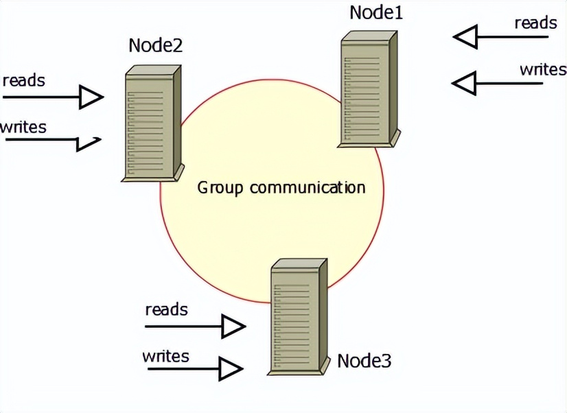

[TOC]


Mysql集群常见的集群方式有两种，第一种是主备模式(一主多备或多主多备);另外一种是Cluster模式，这里介绍Percona XtraDB Cluster(简称PXC-Mysql)搭建方式。

## PXC-Mysql介绍

Pxc-mysql是针对mysql开源的高可用解决方案，集群由多个节点组成，其中每个节点都包含相同的数据集。建议的配置是至少有3个节点，但也可以有2个节点。每个节点都是一个MySQL服务器实例。




Pxc-Mysql集群搭建

准备三台服务器，这里采用docker方式安装，mysql版本是8.022，大家可根据使用自行选择版本

使用docker-compose 部署pxc 集群（三台硬件机器 ubuntu 22.0.4）
对应文件在 /Users/rjzou/git/pxc 目录下
在/home/rjzou/pxc目录下生成/cert 证书

### 1、创建目录
```
$ mkdir -m 777 -p /home/rjzou/pxc/mysql/data
$ mkdir -m 777 -p /home/rjzou/pxc/cert
$ mkdir -m 777 -p /home/rjzou/pxc/config
```
### 2、在config目录中创建cert.cnf
```
$ touch cert.cnf
$ vi cert.cnf
```
把以下内容复制到cert.cnf中
```
[mysqld]
lower_case_table_names=1
sql_mode=STRICT_TRANS_TABLES,NO_ZERO_IN_DATE,NO_ZERO_DATE,ERROR_FOR_DIVISION_BY_ZERO,NO_ENGINE_SUBSTITUTION
ssl-ca = /cert/ca.pem
ssl-cert = /cert/server-cert.pem
ssl-key = /cert/server-key.pem
[client]
ssl-ca = /cert/ca.pem
ssl-cert = /cert/client-cert.pem
ssl-key = /cert/client-key.pem
[sst]
encrypt = 4
ssl-ca = /cert/ca.pem
ssl-cert = /cert/server-cert.pem
ssl-key = /cert/server-key.pem
```
### 3、在主节点创建ssl证书，介绍两种方式

第一种：自动创建ssl证书（推荐使用）
```
sudo docker run --name pxc-cert --rm -v ./cert:/cert percona/percona-xtradb-cluster:8.0.22 mysql_ssl_rsa_setup -d /cert
```

第二种：手动生成秘钥和证书

(1) 创建ca证书，首先要确保系统已安装openssl
```
#创建CA证书
$ cd /cert 
$ openssl genrsa 2048 > ca-key.pem
Generating RSA private key, 2048 bit long modulus (2 primes)
....................................+++++
..+++++
e is 65537 (0x010001)

$ openssl req -new -x509 -nodes -days 3600 \
 -key ca-key.pem -out ca.pem
Can't load /root/.rnd into RNG
140331426972096:error:2406F079:random number generator:RAND_load_file:Cannot open file:../crypto/rand/randfile.c:88:Filename=/root/.rnd
You are about to be asked to enter information that will be incorporated
into your certificate request.
What you are about to enter is what is called a Distinguished Name or a DN.
There are quite a few fields but you can leave some blank
For some fields there will be a default value,
If you enter '.', the field will be left blank.
-----
Country Name (2 letter code) [AU]:CN
State or Province Name (full name) [Some-State]:SH
Locality Name (eg, city) []:
Organization Name (eg, company) [Internet Widgits Pty Ltd]:whu
Organizational Unit Name (eg, section) []:
Common Name (e.g. server FQDN or YOUR name) []:
Email Address []:
```
创建CA的时候需要填一些信息，可根据情况自行填写


(2) 创建服务器证书

```
#创建服务器证书
# server-cert.pem = 公钥, server-key.pem = 私钥
$ openssl req -newkey rsa:2048 -days 3600 \
 -nodes -keyout server-key.pem -out server-req.pem
 
Ignoring -days; not generating a certificate
Can't load /root/.rnd into RNG
140086461567424:error:2406F079:random number generator:RAND_load_file:Cannot open file:../crypto/rand/randfile.c:88:Filename=/root/.rnd
Generating a RSA private key
............................................................................................................................+++++
......................+++++
writing new private key to 'server-key.pem'
-----
You are about to be asked to enter information that will be incorporated
into your certificate request.
What you are about to enter is what is called a Distinguished Name or a DN.
There are quite a few fields but you can leave some blank
For some fields there will be a default value,
If you enter '.', the field will be left blank.
-----
Country Name (2 letter code) [AU]:CN
State or Province Name (full name) [Some-State]:SH
Locality Name (eg, city) []:
Organization Name (eg, company) [Internet Widgits Pty Ltd]:whu #作者随意写的
Organizational Unit Name (eg, section) []:
Common Name (e.g. server FQDN or YOUR name) []:
Email Address []:
Please enter the following 'extra' attributes
to be sent with your certificate request
A challenge password []:
An optional company name []:

 $ openssl rsa -in client-key.pem -out client-key.pem
$ openssl x509 -req -in client-req.pem -days 3600 \
 -CA ca.pem -CAkey ca-key.pem -set_serial 01 -out client-cert.pem
```

注意：创建server证书的时候，需要填一些信息，可根据情况自行填写，填写的信息必须与创建CA时填写的一致

(3) 证书验证

```
$ openssl verify -CAfile ca.pem server-cert.pem client-cert.pem
#如果显示以下内容表示一切么问题
server-cert.pem: OK
client-cert.pem: OK

```
4、创建overlay类型网络，可选

好处是mysql服务都在一个专属的网络ip段。当然也可不创建，通过服务器ip进行访问
```
$ docker network create -d overlay --attachable --subnet=173.30.0.0/16 microservice-net
```

### 分别将上一步的证书复制到各个机器上

```
sudo scp rjzou@ubuntu-home-cherry:/home/rjzou/pxc/cert/*.pem ./cert/
sudo scp rjzou@ubuntu-home-cherry:/home/rjzou/pxc/cert/*.pem ./cert/
```

### 使用命令行执行node1 ,也可以执行sudo docker-compose -f docker-compose-node1.yml up -d

node1:

```
sudo docker run -d \
-p 3309:3306 \
-e MYSQL_ROOT_PASSWORD=123456 \
-e CLUSTER_NAME=PXC \
-e XTRABACKUP_PASSWORD=123456 \
-e "TZ=Asia/Shanghai" \
-v /home/rjzou/pxc/mysql/data:/var/lib/mysql \
-v /home/rjzou/pxc/cert:/cert \
-v /home/rjzou/pxc/config:/etc/percona-xtradb-cluster.conf.d \
--privileged \
--name=node1 \
--net=host \
percona/percona-xtradb-cluster:8.0.22

```

如果使用overlay 网络 就把
--net=host \
替换
--net=microservice-net --ip 173.30.1.11 \


### 使用命令执行node2,也可以执行sudo docker-compose -f docker-compose-node2.yml up -d

node2

```
sudo docker run -d \
-p 3309:3306 \
-e MYSQL_ROOT_PASSWORD=123456 \
-e CLUSTER_NAME=PXC \
-e XTRABACKUP_PASSWORD=123456 \
-e "TZ=Asia/Shanghai" \
-e CLUSTER_JOIN=192.168.3.38 \
-v /home/rjzou/pxc/mysql/data:/var/lib/mysql \
-v /home/rjzou/pxc/cert:/cert \
-v /home/rjzou/pxc/config:/etc/percona-xtradb-cluster.conf.d \
--privileged \
--name=node2 \
--net=host \
percona/percona-xtradb-cluster:8.0.22

```
```
如果使用overlay 网络 就把
--net=host \
替换
--net=microservice-net --ip 173.30.1.12 \
```
```
同时
-e CLUSTER_JOIN=192.168.3.38 \
替换
-e CLUSTER_JOIN=node1 \
```

### 使用命令执行node3,也可以执行sudo docker-compose -f docker-compose-node3.yml up -d
node3 

```
sudo docker run -d \
-p 3309:3306 \
-e MYSQL_ROOT_PASSWORD=123456 \
-e CLUSTER_NAME=PXC \
-e XTRABACKUP_PASSWORD=123456 \
-e "TZ=Asia/Shanghai" \
-e CLUSTER_JOIN=192.168.3.38 \
-v /home/rjzou/pxc/mysql/data:/var/lib/mysql \
-v /home/rjzou/pxc/cert:/cert \
-v /home/rjzou/pxc/config:/etc/percona-xtradb-cluster.conf.d \
--privileged \
--name=node3 \
--net=host \
percona/percona-xtradb-cluster:8.0.22

```
```
如果使用overlay 网络 就把
--net=host \
替换
--net=microservice-net --ip 173.30.1.13 \
```
```
同时
-e CLUSTER_JOIN=192.168.3.38 \
替换
-e CLUSTER_JOIN=node1 \
```

### 验证
```
$ docker exec -it node1 /usr/bin/mysql -uroot -p<密码>
```

注意：其中一个节点断开，无法重启，修改grastate.dat中的safe_to_bootstrap: 0改为1。
```
$ cd /home/rjzou/pxc/mysql/data
$ vi grastate.dat
safe_to_bootstrap: 1
```
注意：node2和node3节点需等node1创建成功后再创建，否则会导致无法加入集群。另外，集群需要同步服务器时钟，如果购买的是云服务器，则不需要同步，供应商已为我们做了同步。

### 再在node1上执行haproxy, sudo docker-compose -f docker-compose-haproxy.yml up -d

访问地址http://192.168.3.38:4001/dbs （admin/123456）

### 至此，mysql三节点集群已创建，可连接任何一台mysql写入数据，其它节点数据库均能实时同步数据。


注意：如果启动不了，可以清空/home/rjzou/pxc/mysql/data下的数据，使用sudo rm -rf /home/rjzou/pxc/mysql/data/*

END